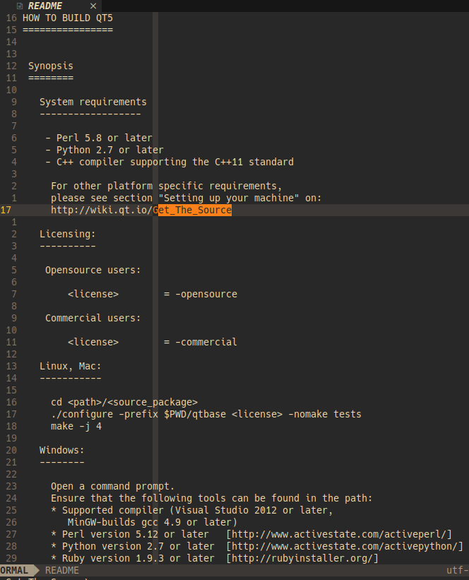
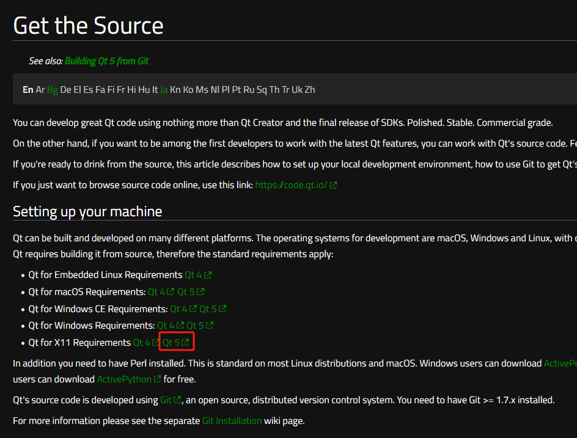
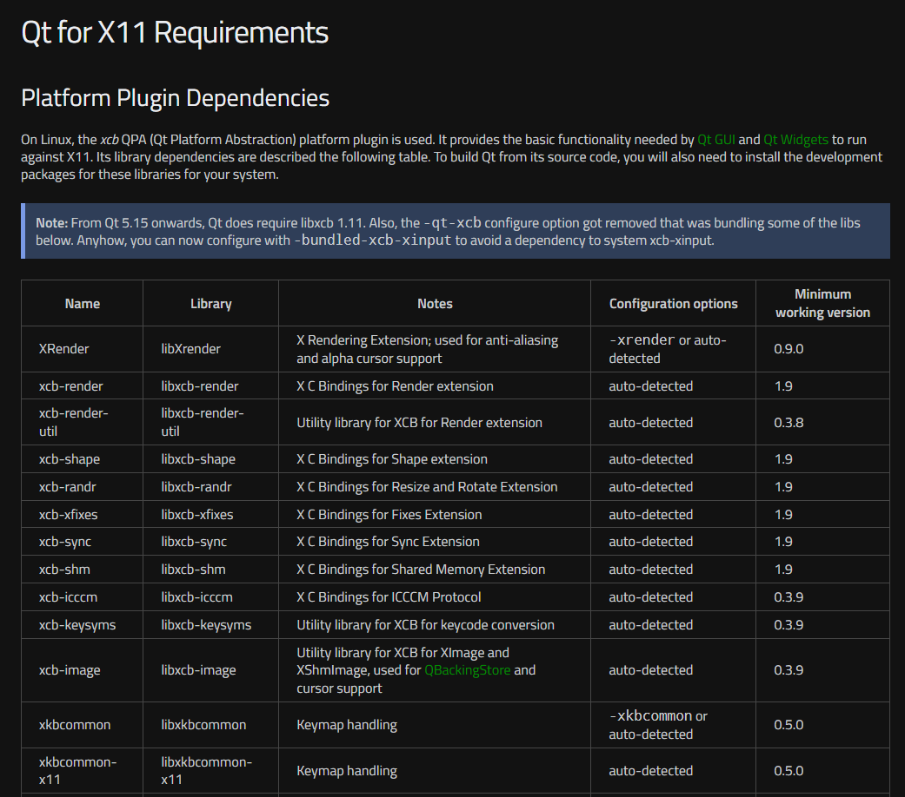
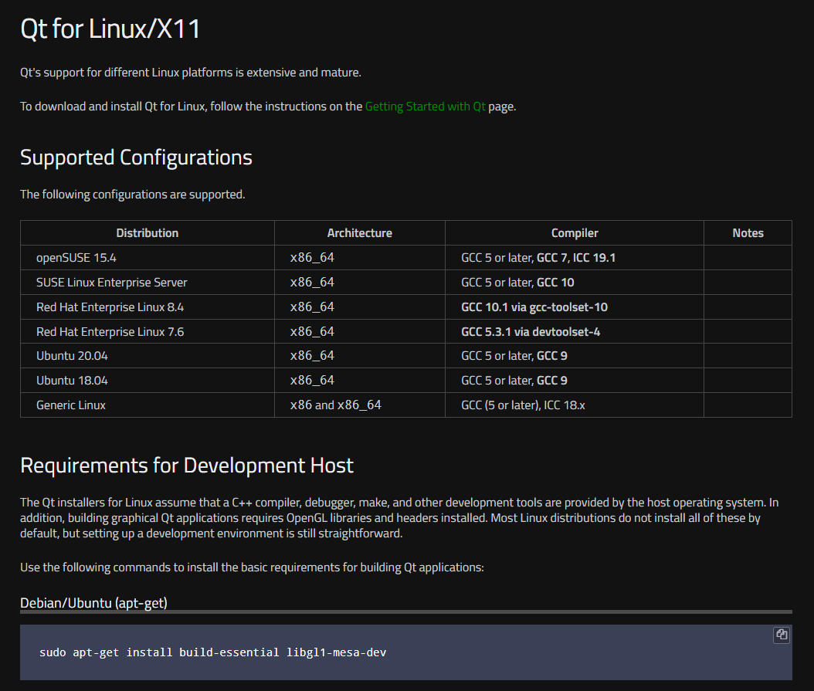
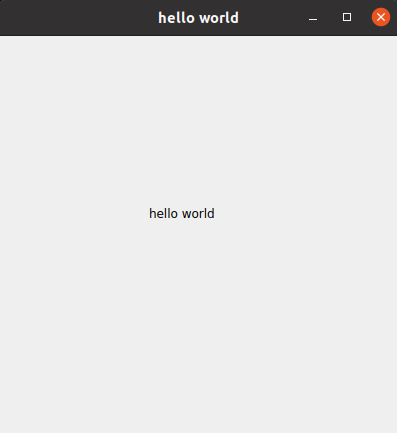

# 编译qt5.15.11版本

---

[TOC]

## 进行影子编译(shadow build)

---

建立一个空的目录，用于配置和编译源码，避免污染源码目录

```shell
~/qt/5.15.11/build$ ls
build.sh
```

## 从源码`README`开始

---

解压源码

```shell
~//qt/5.15.11/src$ ls
qt-everywhere-src-5.15.11.tar.xz
$ tar xvf qt-everywhere-src-5.15.11.tar.xz
```

查看根目录下的`README`文件



[编译各个平台](https://wiki.qt.io/Get_the_Source) 



URL: [安装X11平台的依赖库](https://doc.qt.io/qt-5/linux-requirements.html)



URL: [编译X11平台](https://doc.qt.io/qt-5/linux.html)



## 安装相关依赖

URL: [install dependencies](https://wiki.qt.io/Building_Qt_5_from_Git) 

---

* 基本环境

```shell
$ sudo apt install -y git perl python3 build-essential
```

* 安装第三方库
```shell
$ sudo apt install -y zlib1g-dev libjpeg-dev libpng-dev libfreetype-dev libpcre3-dev libharfbuzz-dev
```

* 安装工具类库

```shell
$ sudo apt install -y libwayland-dev gperf bison flex libudev-dev libdouble-conversion-dev
```

* libxcb

```shell
$ sudo apt install '^libxcb.*-dev' libx11-xcb-dev libglu1-mesa-dev libxrender-dev libxi-dev libxkbcommon-dev libxkbcommon-x11-dev
```

* OpenGL support

* Accessibility

```shell
$ sudo apt install -y libatspi2.0-dev libdbus-1-dev
```

* ~~Qt WebKit(qt 5.6后废弃)~~

```shell
$ sudo apt install -y flex bison gperf libicu-dev libxslt-dev ruby
```

* Qt WebEngine(qt 5.4后使用)

```shell
$ sudo apt install -y libxcursor-dev libxcomposite-dev libxdamage-dev libxrandr-dev libxtst-dev libxss-dev libdbus-1-dev libevent-dev libfontconfig1-dev libcap-dev libpulse-dev libudev-dev libpci-dev libnss3-dev libasound2-dev libegl1-mesa-dev gperf bison nodejs
```

>> 比较: 
>>
>> 同步/异步: QWebKit多是同步进行，包括JS调用，获取返回值等; QWebEngine几乎所有操作都是异步操作
>>
>> H5兼容性：QWebKit兼容性较差；QWebEngine兼容性较好
>>
>> windows兼容性：QwebKit兼容性较好，QWebEngine兼容性较差
>>
>> 版本：QwebKit在5.6后废弃了，QWebEngine在5.4后使用


* Qt Multimedia

```shell
$ sudo apt install -y libasound2-dev libgstreamer1.0-dev libgstreamer-plugins-base1.0-dev libgstreamer-plugins-good1.0-dev libgstreamer-plugins-bad1.0-dev
```

* QDoc Documentation Generator Tool

```shell
$ sudo apt install -y clang libclang-dev
```

## 编译
---

### 编译`ubuntu`版本
---

```shell
$ ./configure \
-prefix /mnt/nfs/pc/pc-chip \
-release \
-opensource -confirm-license \
-shared \
-optimize-size \
-nomake tests \
-nomake examples

$ make -j12
```

### 交叉编译
---


## demo测试
---

helloworld.cpp

```c++
#include <QApplication>
#include <QWidget>
#include <QLabel>

int main(int argc, char* argv[])
{
    QApplication app(argc, argv);

    QWidget w;
    w.resize(400, 400);
    w.setWindowTitle("hello world");

    QLabel textLabel;
    textLabel.resize(100,15);
    textLabel.move(150, 170);
    textLabel.setText("hello world");
    textLabel.setParent(&w);
    textLabel.show();

    w.show();
    return app.exec();
}
```

helloworld.pro

```qmake
######################################################################
# Automatically generated by qmake (3.1) Thu Apr 15 11:11:51 2021
######################################################################
QT       += core gui

greaterThan(QT_MAJOR_VERSION, 4): QT += widgets

CONFIG += c++11

TEMPLATE = app
TARGET = helloworld
INCLUDEPATH += .

# The following define makes your compiler warn you if you use any
# feature of Qt which has been marked as deprecated (the exact warnings
# depend on your compiler). Please consult the documentation of the
# deprecated API in order to know how to port your code away from it.
DEFINES += QT_DEPRECATED_WARNINGS

# You can also make your code fail to compile if you use deprecated APIs.
# In order to do so, uncomment the following line.
# You can also select to disable deprecated APIs only up to a certain version of Qt.
#DEFINES += QT_DISABLE_DEPRECATED_BEFORE=0x060000    # disables all the APIs deprecated before Qt 6.0.0

# Input
SOURCES += helloworld.cpp
```



