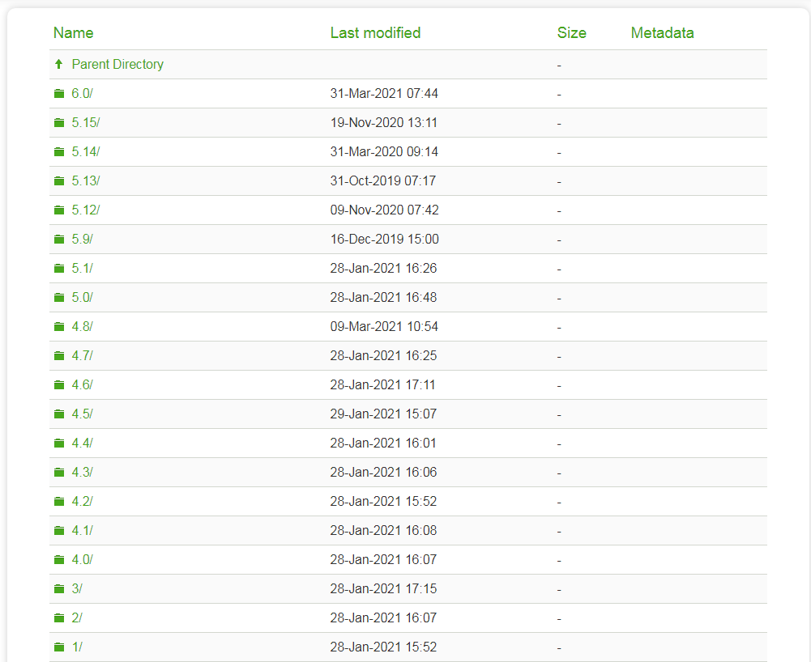
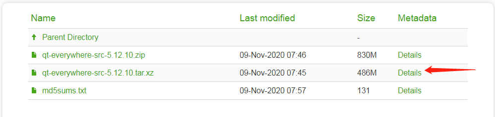
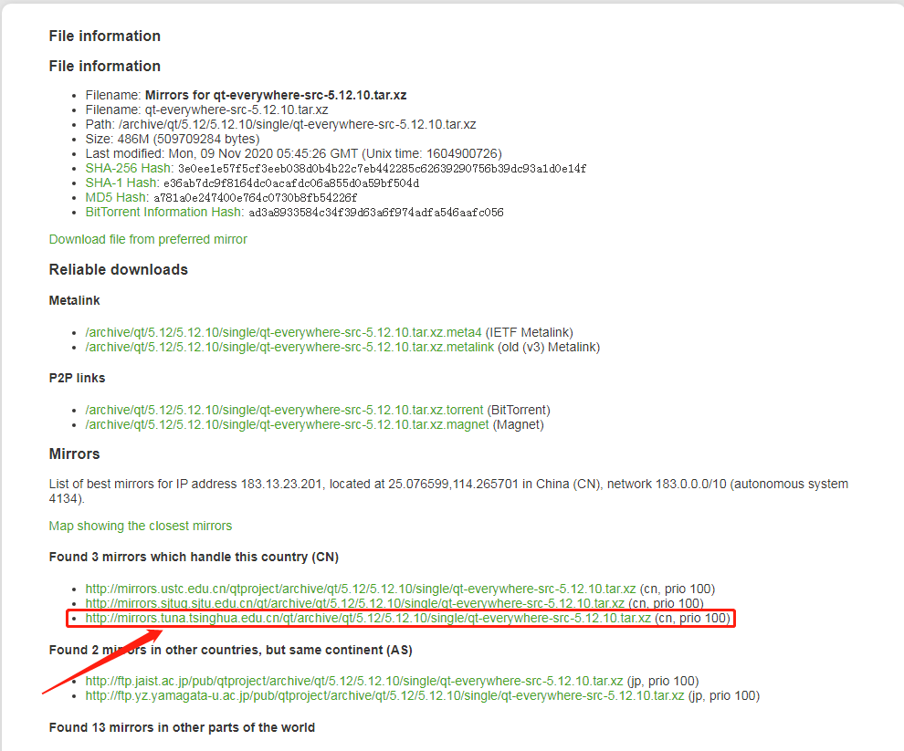
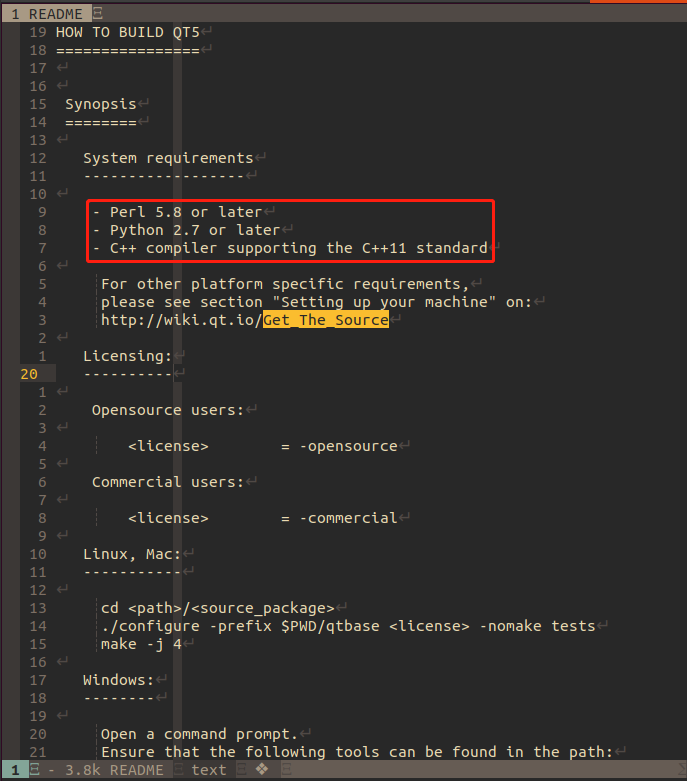
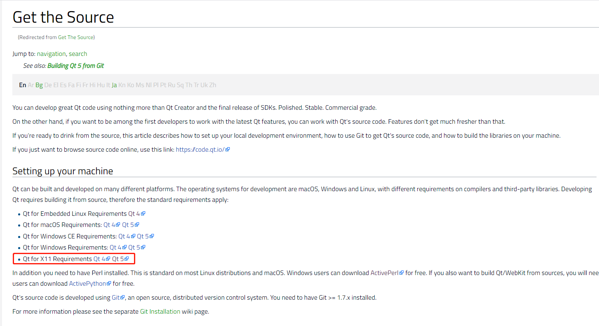
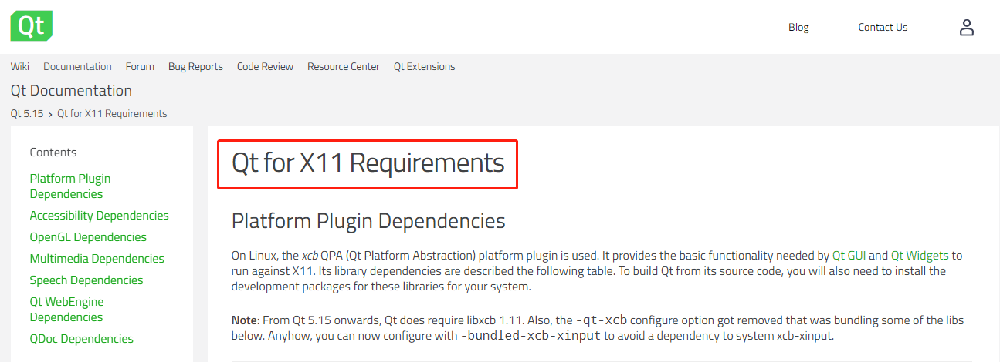
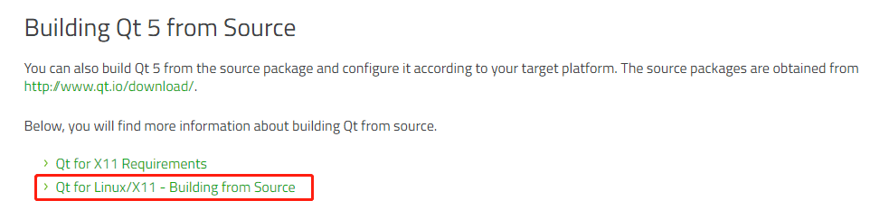

# compile-qt

Cross compiling QT

<!-- vim-markdown-toc GFM -->

* [编译`ubuntu`版本](#编译ubuntu版本)
  - [下载源码](#下载源码)
  - [编译源码](#编译源码)
    + [解压源码](#解压源码)
    + [基础性依赖](#基础性依赖)
    + [ubuntu中的依赖](#ubuntu中的依赖)
    + [编译源码](#编译源码-1)

<!-- vim-markdown-toc -->

## 编译`ubuntu`版本

### 下载源码

* [官网地址](https://download.qt.io/archive/qt/) 

下载对应的版本



* [这里选择5.12.10](https://download.qt.io/archive/qt/5.12/5.12.10/single/)



点击后面的`Details`，选择清华镜像源进行下载



下载完成后，放到一个指定的目录下，方便后续操作。

### 编译源码

#### 解压源码

```shell
$ tar xvf qt-everywhere-src-5.12.10.tar.xz
```

#### 基础性依赖

查看根目录下的`README`文件, 安装红色框中的依赖



```shell
$ sudo apt install -y perl
$ sudo apt install -y python3.8
$ sudo apt install -y build-essential
```

特定系统的相关依赖见[`Get_The_Source`](https://wiki.qt.io/Get_the_Source)



#### ubuntu中的依赖

URL: [`Qt for X11 Requirements`](https://doc.qt.io/qt-5/linux-requirements.html)



* 平台插件依赖项(Platform Plugin Dependencies)

```shell
$ sudo apt install -y libfontconfig1-dev
$ sudo apt install -y libfreetype6-dev
$ sudo apt install -y libx11-dev
$ sudo apt install -y libx11-xcb-dev
$ sudo apt install -y libxext-dev
$ sudo apt install -y libxfixes-dev
$ sudo apt install -y libxi-dev
$ sudo apt install -y libxrender-dev
$ sudo apt install -y libxcb1-dev
$ sudo apt install -y libxcb-glx0-dev
$ sudo apt install -y libxcb-keysyms1-dev
$ sudo apt install -y libxcb-image0-dev
$ sudo apt install -y libxcb-shm0-dev
$ sudo apt install -y libxcb-icccm4-dev
$ sudo apt install -y libxcb-xfixes0-dev
$ sudo apt install -y libxcb-shape0-dev
$ sudo apt install -y libxcb-randr0-dev
$ sudo apt install -y libxcb-render-util0-dev
$ sudo apt install -y libxkbcommon-dev
$ sudo apt install -y libxkbcommon-x11-dev
$ sudo apt install -y libxcb-sync-dev

# 没有找到的依赖库
$ sudo apt install -y libxcd-xinerama-dev
$ sudo apt install -y libxcb-sync0-dev
```

* 辅助功能依赖项(Accessibility Dependencies)

```shell
$ sudo apt install -y libatspi2.0-dev
```

* OpenGL依赖项(OpenGL Dependencies)

```shell
$ sudo apt install -y libgles2-mesa
$ sudo apt install -y libgles2-mesa-dev
```

* 多媒体相关性(Multimedia Dependencies)

```shell
$ sudo apt install -y libgstreamer1.0-0
$ sudo apt install -y gstreamer1.0-plugins-base
$ sudo apt install -y gstreamer1.0-plugins-good
$ sudo apt install -y gstreamer1.0-plugins-bad
$ sudo apt install -y gstreamer1.0-plugins-ugly
$ sudo apt install -y gstreamer1.0-libav
$ sudo apt install -y gstreamer1.0-doc
$ sudo apt install -y gstreamer1.0-tools
$ sudo apt install -y gstreamer1.0-x
$ sudo apt install -y gstreamer1.0-alsa
$ sudo apt install -y gstreamer1.0-gl
$ sudo apt install -y gstreamer1.0-gtk3
$ sudo apt install -y gstreamer1.0-qt5
$ sudo apt install -y gstreamer1.0-pulseaudio
```

* 语音相关性(Speech Dependencies)

```shell
sudo apt install -y flite1-dev
sudo apt install -y libspeechd-dev
sudo apt install -y speech-dispatcher
```

#### 编译源码

URL: [`Get_The_Source`](https://wiki.qt.io/Get_the_Source)


URL: [`Qt for Linux/X11`](https://doc.qt.io/qt-5/linux.html)

* 开发主机要求(Requirements for Development Host)

```shell
$ sudo apt-get install -y build-essential libgl1-mesa-dev
```



* 编译

```shell
$ ./configure -release -prefix $INSTALL_PREFIX -opensource -confirm-license -nomake tests
$ make
```


