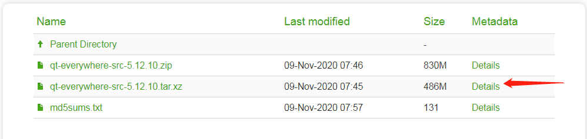
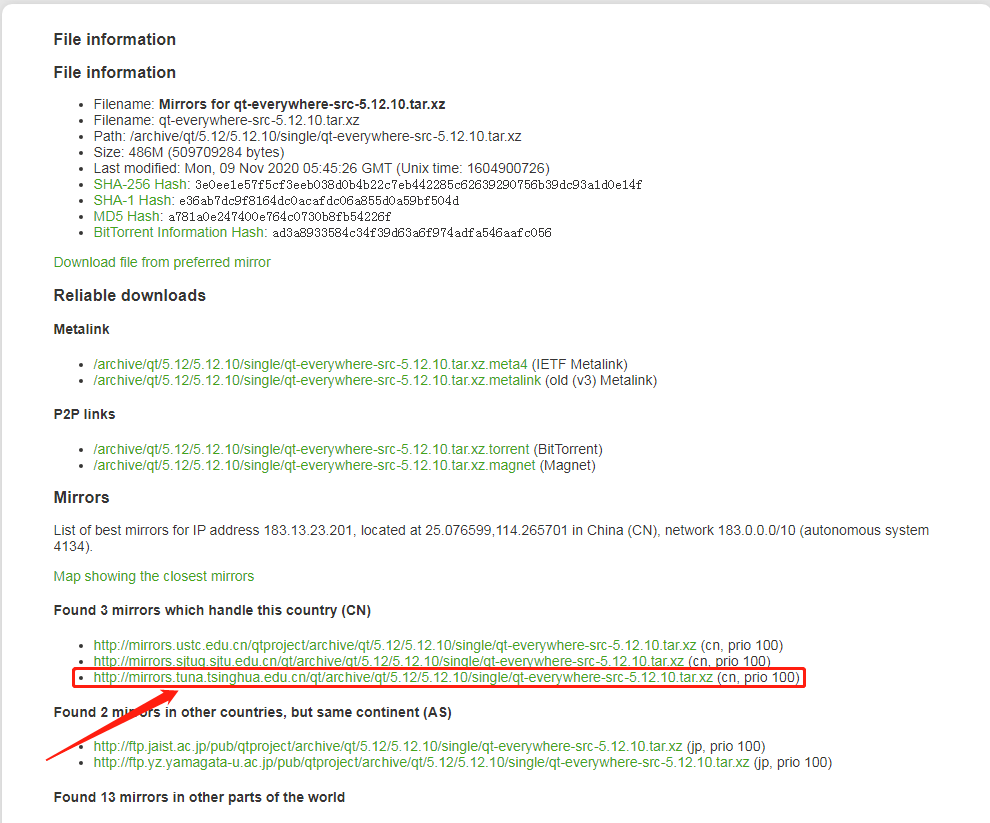
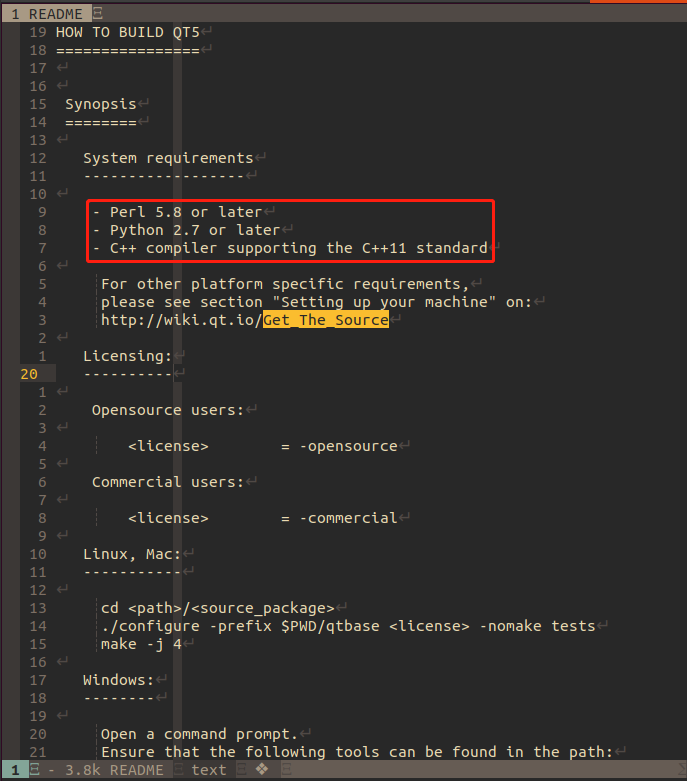
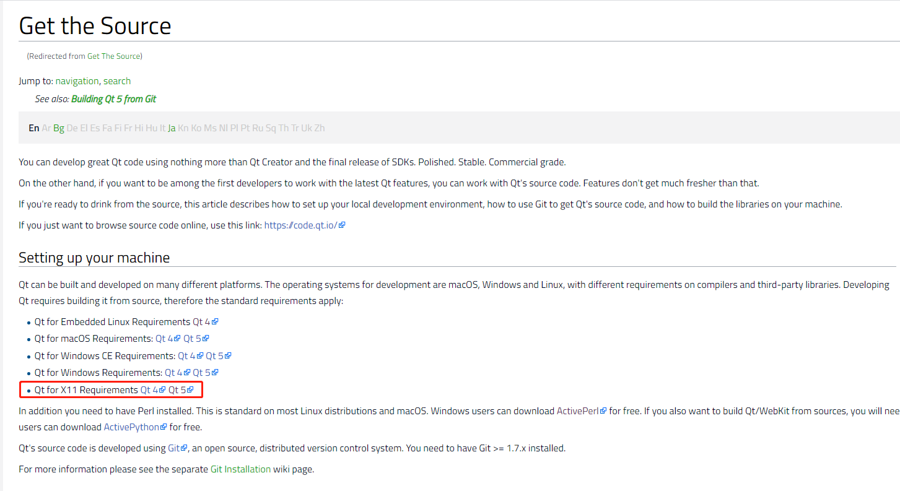
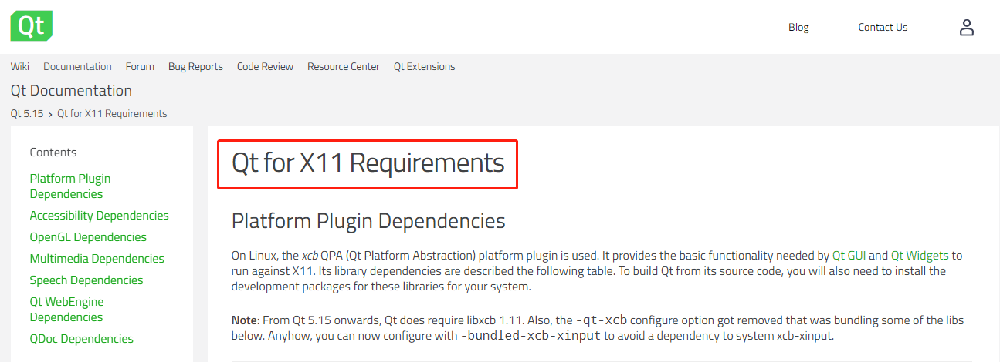
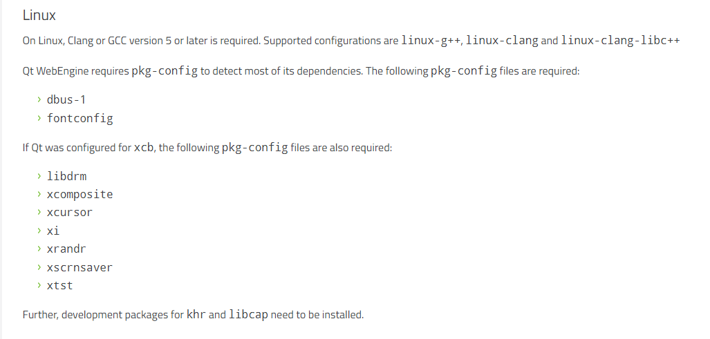
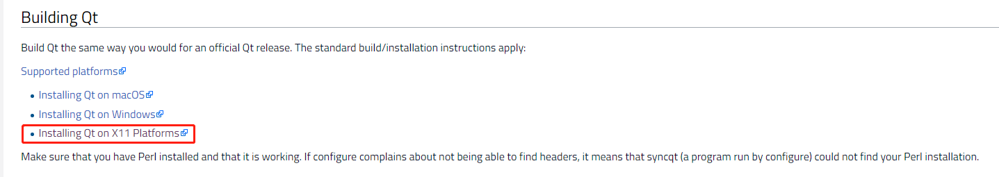

# compile-ubuntu

<!-- vim-markdown-toc GFM -->

* [编译`ubuntu`版本](#编译ubuntu版本)
  - [下载源码](#下载源码)
  - [编译源码](#编译源码)
    + [解压源码](#解压源码)
    + [基础性依赖](#基础性依赖)
    + [ubuntu中的依赖](#ubuntu中的依赖)
    + [编译源码](#编译源码-1)

<!-- vim-markdown-toc -->

## 编译`ubuntu`版本

### 下载源码

* [官网地址](https://download.qt.io/archive/qt/) 

下载对应的版本


* [这里选择5.12.10](https://download.qt.io/archive/qt/5.12/5.12.10/single/)



点击后面的`Details`，选择清华镜像源进行下载



下载完成后，放到一个指定的目录下，方便后续操作。

### 编译源码

#### 解压源码

```shell
$ tar xvf qt-everywhere-src-5.12.10.tar.xz
```

#### 基础性依赖

查看根目录下的`README`文件, 安装红色框中的依赖



```shell
$ sudo apt install -y perl
$ sudo apt install -y python3.8
$ sudo apt install -y build-essential
```

特定系统的相关依赖见[`Get_The_Source`](https://wiki.qt.io/Get_the_Source)



#### ubuntu中的依赖

URL: [`Qt for X11 Requirements`](https://doc.qt.io/qt-5/linux-requirements.html)



* 平台插件依赖项(Platform Plugin Dependencies)

```shell
$ sudo apt install -y libfontconfig1-dev
$ sudo apt install -y libfreetype6-dev
$ sudo apt install -y libx11-dev
$ sudo apt install -y libx11-xcb-dev
$ sudo apt install -y libxext-dev
$ sudo apt install -y libxfixes-dev
$ sudo apt install -y libxi-dev
$ sudo apt install -y libxrender-dev
$ sudo apt install -y libxcb1-dev
$ sudo apt install -y libxcb-glx0-dev
$ sudo apt install -y libxcb-keysyms1-dev
$ sudo apt install -y libxcb-image0-dev
$ sudo apt install -y libxcb-shm0-dev
$ sudo apt install -y libxcb-icccm4-dev
$ sudo apt install -y libxcb-xfixes0-dev
$ sudo apt install -y libxcb-shape0-dev
$ sudo apt install -y libxcb-randr0-dev
$ sudo apt install -y libxcb-render-util0-dev
$ sudo apt install -y libxkbcommon-dev
$ sudo apt install -y libxkbcommon-x11-dev
$ sudo apt install -y libxcb-sync-dev

# 整合在一起方便安装
$ sudo apt install -y libfontconfig1-dev libfreetype6-dev libx11-dev libx11-xcb-dev libxext-dev libxfixes-dev libxi-dev libxrender-dev libxcb1-dev libxcb-glx0-dev libxcb-keysyms1-dev libxcb-image0-dev libxcb-shm0-dev libxcb-icccm4-dev libxcb-xfixes0-dev libxcb-shape0-dev libxcb-randr0-dev libxcb-render-util0-dev libxkbcommon-dev libxkbcommon-x11-dev libxcb-sync-dev

# 没有找到的依赖库
$ sudo apt install -y libxcd-xinerama-dev
$ sudo apt install -y libxcb-sync0-dev # 使用libxcb-sync-dev替代
```

* 辅助功能依赖项(Accessibility Dependencies)

```shell
$ sudo apt install -y libatspi2.0-dev
```

* OpenGL依赖项(OpenGL Dependencies)

    * 安装`C/C++`编译环境

    ```shell
    $ sudo apt install -y build-essential
    ```

    * OpenGL核心库，GL

    ```shell
    $ sudo apt install -y libgl1-mesa-dev
    $ sudo apt install -y libgles2-mesa-dev  # 嵌入式平台
    ```

    * OpenGL实用函数库，GLU

    ```shell
    $ sudo apt install -y libglu1-mesa-dev
    ```

    * OpenGL实用工具包，GLUT

    ```shell
    $ sudo apt install -y freeglut3-dev
    ```

    * 额外安装的包

    ```shell
    $ sudo apt install -y libglew-dev libsdl2-dev libsdl2-image-dev libglm-dev libfreetype6-dev libglfw3-dev libglfw3
    ```

* 多媒体相关性(Multimedia Dependencies)

```shell
$ sudo apt install -y libgstreamer1.0-0
$ sudo apt install -y gstreamer1.0-plugins-base
$ sudo apt install -y gstreamer1.0-plugins-good
$ sudo apt install -y gstreamer1.0-plugins-bad
$ sudo apt install -y gstreamer1.0-plugins-ugly
$ sudo apt install -y gstreamer1.0-libav
$ sudo apt install -y gstreamer1.0-doc
$ sudo apt install -y gstreamer1.0-tools
$ sudo apt install -y gstreamer1.0-x
$ sudo apt install -y gstreamer1.0-alsa
$ sudo apt install -y gstreamer1.0-gl
$ sudo apt install -y gstreamer1.0-gtk3
$ sudo apt install -y gstreamer1.0-qt5
$ sudo apt install -y gstreamer1.0-pulseaudio

# 整合在一起方便安装
$ sudo apt install -y libgstreamer1.0-0 gstreamer1.0-plugins-base gstreamer1.0-plugins-good gstreamer1.0-plugins-bad gstreamer1.0-plugins-ugly gstreamer1.0-libav gstreamer1.0-doc gstreamer1.0-tools gstreamer1.0-x gstreamer1.0-alsa gstreamer1.0-gl gstreamer1.0-gtk3 gstreamer1.0-qt5 gstreamer1.0-pulseaudio
```

URL: [gstreamer](https://gstreamer.freedesktop.org/documentation/installing/on-linux.html?gi-language=c)

* 语音相关性(Speech Dependencies)

```shell
sudo apt install -y flite1-dev
sudo apt install -y libspeechd-dev
sudo apt install -y speech-dispatcher
```

* Qt WebEngine依赖项(Qt WebEngine Dependencies)



```shell
$ sudo apt install -y libdbus-1-dev
$ sudo apt install -y libfontconfig1-dev

$ sudo apt install -y libdrm-dev
$ sudo apt install -y libxcomposite-dev
$ sudo apt install -y libxcursor-dev
$ sudo apt install -y libxi-dev
$ sudo apt install -y libxrandr-dev
$ sudo apt install -y libxss-dev
$ sudo apt install -y libxtst-dev

$ sudo apt install -y libcap-dev

# 整合在一起方便安装
$ sudo apt install -y libdbus-1-dev libfontconfig1-dev libdrm-dev libxcomposite-dev libxcursor-dev libxi-dev libxrandr-dev libxss-dev libxtst-dev libcap-dev

```

URL: [Qt WebEngine](https://doc.qt.io/qt-5/qtwebengine-platform-notes.html#linux)

* QDoc依赖项(QDoc Dependencies)

    * 在`/etc/apt/sources.list.d`目录下`llvm-11-12.list`文件

        ```shell
        $ sudo vim /etc/apt/sources.list.d/llvm-11-12.list

        # i386 not available
        deb http://apt.llvm.org/focal/ llvm-toolchain-focal main
        deb-src http://apt.llvm.org/focal/ llvm-toolchain-focal main
        # 11
        deb http://apt.llvm.org/focal/ llvm-toolchain-focal-11 main
        deb-src http://apt.llvm.org/focal/ llvm-toolchain-focal-11 main
        # 12
        deb http://apt.llvm.org/focal/ llvm-toolchain-focal-12 main
        deb-src http://apt.llvm.org/focal/ llvm-toolchain-focal-12 main
        ```

    * 添加软件包密钥

        ```shell
        $ wget -O - https://apt.llvm.org/llvm-snapshot.gpg.key|sudo apt-key add -
        ```

    * 安装软件

        ```shell
        # LLVM
        $ apt install -y libllvm-12-ocaml-dev libllvm12 llvm-12 llvm-12-dev llvm-12-doc llvm-12-examples llvm-12-runtime
        # Clang and co
        apt install -y clang-12 clang-tools-12 clang-12-doc libclang-common-12-dev libclang-12-dev libclang1-12 clang-format-12 python-clang-12 clangd-12
        # libfuzzer
        apt install -y libfuzzer-12-dev
        # lldb
        apt install -y lldb-12
        # lld (linker)
        apt install -y lld-12
        # libc++
        apt install -y libc++-12-dev libc++abi-12-dev
        # OpenMP
        apt install -y libomp-12-dev
        ```

    URL: [Installing Clang for QDoc](https://doc.qt.io/qt-5/qdoc-guide-clang.html)

    URL: [llvm官网](https://clang.llvm.org/)

    URL: [apt.llvm(apt源)](https://apt.llvm.org/)


#### 编译源码

URL: [`Get_The_Source`](https://wiki.qt.io/Get_the_Source)



URL: [`Qt for Linux/X11`](https://doc.qt.io/qt-5/linux.html)

* 开发主机要求(Requirements for Development Host)

```shell
$ sudo apt install -y build-essential libgl1-mesa-dev
```


* 编译

    * 安装第三方库

    ```shell
    $ sudo apt install -y zlib1g-dev
    $ sudo apt install -y libjpeg-dev
    $ sudo apt install -y libpng-dev
    $ sudo apt install -y libfreetype-dev
    $ sudo apt install -y libpcre3-dev
    $ sudo apt install -y libharfbuzz-dev

    # 整合在一起方便安装
    $ sudo apt install -y zlib1g-dev libjpeg-dev libpng-dev libfreetype-dev libpcre3-dev libharfbuzz-dev
    ```

    * 安装工具类库

    ```shell
    $ sudo apt install -y libwayland-dev
    $ sudo apt install -y gperf
    $ sudo apt install -y bison
    $ sudo apt install -y flex
    $ sudo apt install -y libudev-dev
    $ sudo apt install -y libdouble-conversion-dev

    # 整合在一起方便安装
    $ sudo apt install -y libwayland-dev gperf bison flex libudev-dev libdouble-conversion-dev
    ```

    * 无裁剪编译

    ```shell
    ./configure -release -prefix $INSTALL_PREFIX -opensource -confirm-license -nomake tests -system-zlib -system-libjpeg -system-libpng -system-freetype -system-pcre -system-harfbuzz
    make
    ```

