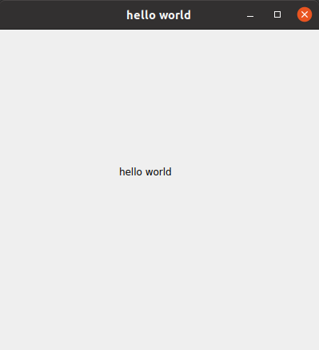

# helloworld

## 编写源码

* 编辑`helloworld.cpp`源码

```cpp
/**
 * 
 * Release under GPLv-3.0.
 * 
 * @file    helloworld.cpp
 * @brief   
 * @author  gnsyxiang <gnsyxiang@163.com>
 * @date    15/04 2021 11:05
 * @version v0.0.1
 * 
 * @since    note
 * @note     note
 * 
 *     change log:
 *     NO.     Author              Date            Modified
 *     00      zhenquan.qiu        15/04 2021      create the file
 * 
 *     last modified: 15/04 2021 11:05
 */
#include <QApplication>
#include <QWidget>
#include <QLabel>

int main(int argc, char* argv[])
{
    QApplication app(argc, argv);

    QWidget w;
    w.resize(400, 400);
    w.setWindowTitle("hello world");

    QLabel textLabel;
    textLabel.resize(100,15);
    textLabel.move(150, 170);
    textLabel.setText("hello hello");
    textLabel.setParent(&w);
    textLabel.show();

    w.show();
    return app.exec();
}
```

* 查看当前目录文件:

```shell
$ ls
helloworld.cpp
```

## 生成项目管理文件(*.pro)

```shell
$ qmake -project

$ ls
helloworld.cpp  helloworld.pro
```

> 只需要执行一次，否则会覆盖`helloworld.pro`文件

## 生成项目编译文件(Makefile)

```shell
$ qmake     # qmake -makefile等价

$ ls
helloworld.cpp  helloworld.pro  Makefile
```

## 编译项目

* 编译项目

```shell
$ make 
g++ -c -pipe -O2 -Wall -W -D_REENTRANT -fPIC -DQT_DEPRECATED_WARNINGS -DQT_NO_DEBUG -DQT_GUI_LIB -DQT_CORE_LIB -I. -I. -I../../../usr/local/include -I../../../usr/local/include/QtGui -I../../../usr/local/include/QtCore -I. -I../../../usr/local/mkspecs/linux-g++ -o helloworld.o helloworld.cpp
helloworld.cpp:20:10: fatal error: QApplication: No such file or directory
   20 | #include <QApplication>
      |          ^~~~~~~~~~~~~~
compilation terminated.
make: *** [Makefile:685: helloworld.o] Error 1
```

* 在`*.pro`文件中添加qt相关模块

```textLabel
######################################################################
# Automatically generated by qmake (3.1) Thu Apr 15 11:11:51 2021
######################################################################
QT       += core gui

greaterThan(QT_MAJOR_VERSION, 4): QT += widgets

CONFIG += c++11

TEMPLATE = app
TARGET = helloworld
INCLUDEPATH += .

# The following define makes your compiler warn you if you use any
# feature of Qt which has been marked as deprecated (the exact warnings
# depend on your compiler). Please consult the documentation of the
# deprecated API in order to know how to port your code away from it.
DEFINES += QT_DEPRECATED_WARNINGS

# You can also make your code fail to compile if you use deprecated APIs.
# In order to do so, uncomment the following line.
# You can also select to disable deprecated APIs only up to a certain version of Qt.
#DEFINES += QT_DISABLE_DEPRECATED_BEFORE=0x060000    # disables all the APIs deprecated before Qt 6.0.0

# Input
SOURCES += helloworld.cpp
```

* 修改`*.pro`文件后都需要更新`Makefile`文件

```shell
$ qmake
```
* 再次编译源码

```shell
$ make
g++ -c -pipe -O2 -std=gnu++11 -Wall -W -D_REENTRANT -fPIC -DQT_DEPRECATED_WARNINGS -DQT_NO_DEBUG -DQT_WIDGETS_LIB -DQT_GUI_LIB -DQT_CORE_LIB -I. -I. -I../../../usr/local/include -I../../../usr/local/include/QtWidgets -I../../../usr/local/include/QtGui -I../../../usr/local/include/QtCore -I. -I../../../usr/local/mkspecs/linux-g++ -o helloworld.o helloworld.cpp
g++ -Wl,-O1 -Wl,-rpath,/home/uos/data/usr/local/lib -o helloworld helloworld.o   /home/uos/data/usr/local/lib/libQt5Widgets.so /home/uos/data/usr/local/lib/libQt5Gui.so /home/uos/data/usr/local/lib/libQt5Core.so /usr/lib/x86_64-linux-gnu/libGL.so -lpthread
```

## 运行项目

```shell
$ ./helloworld
```

出现如下，表示运行成功



[源码目录见](helloworld)
