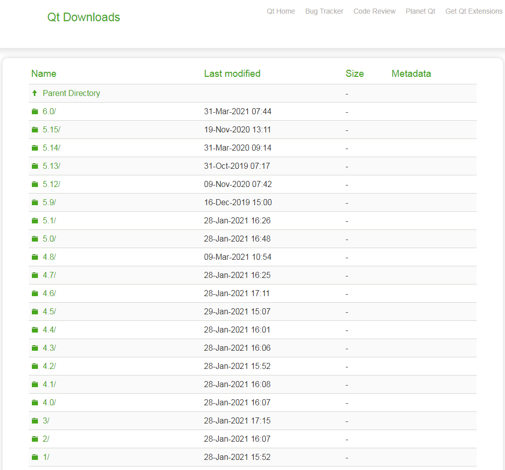
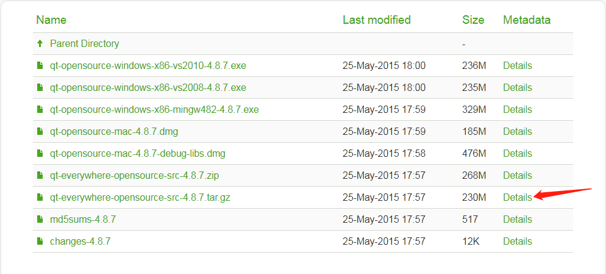
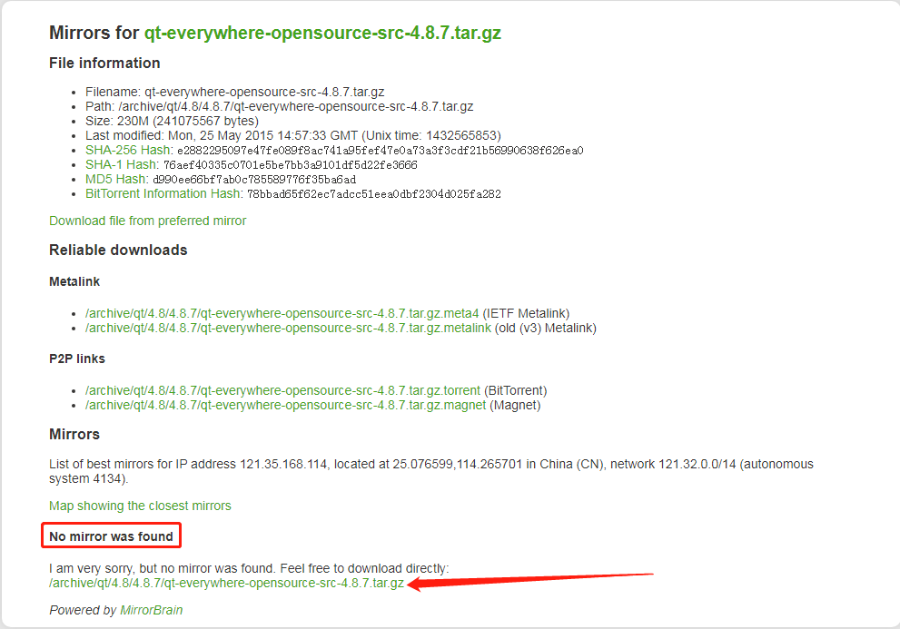
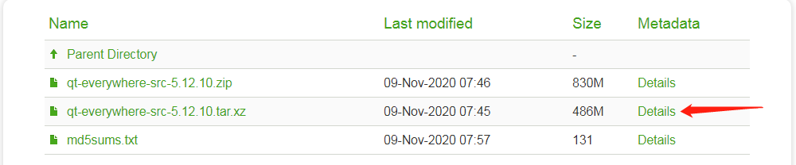
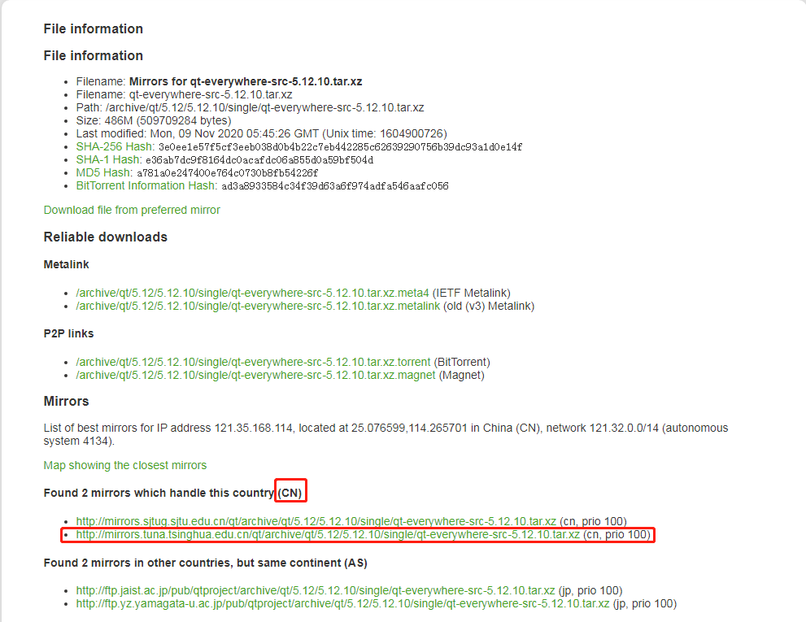

# 源码下载

<!-- vim-markdown-toc GFM -->

* [源码下载](#源码下载)
  - [`4.8.7`版本](#487版本)
  - [`5.12.10`版本](#51210版本)

<!-- vim-markdown-toc -->

## 源码下载

* [官网地址](https://download.qt.io/archive/qt/) 

### `4.8.7`版本

[4.8.7](https://download.qt.io/archive/qt/4.8/4.8.7/)

点击后面的`Details`

> 没有找到国内的镜像，只能通过官网下载了

下载完成后，放到一个指定的目录下，方便后续操作。

### `5.12.10`版本

[5.12.10](https://download.qt.io/archive/qt/5.12/5.12.10/single/)

点击后面的`Details`，选择清华镜像源进行下载

下载完成后，放到一个指定的目录下，方便后续操作。

