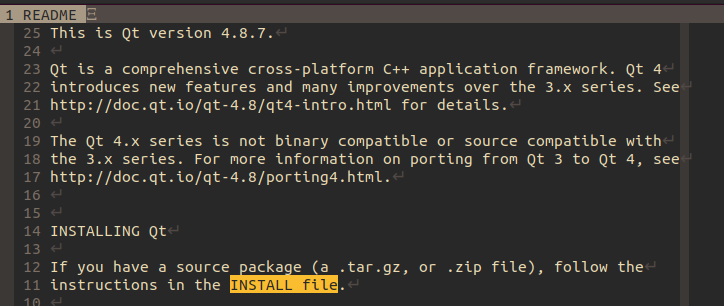
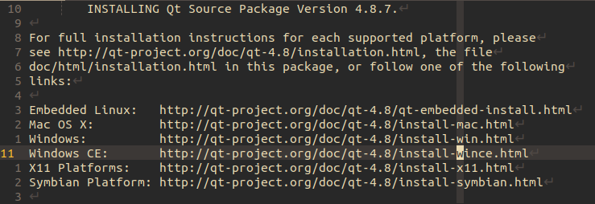
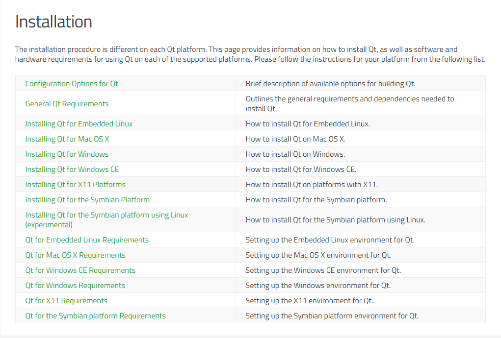
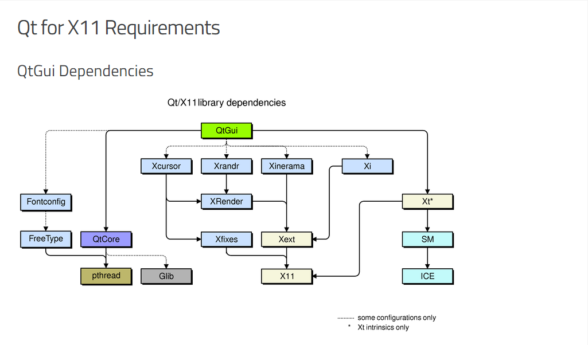
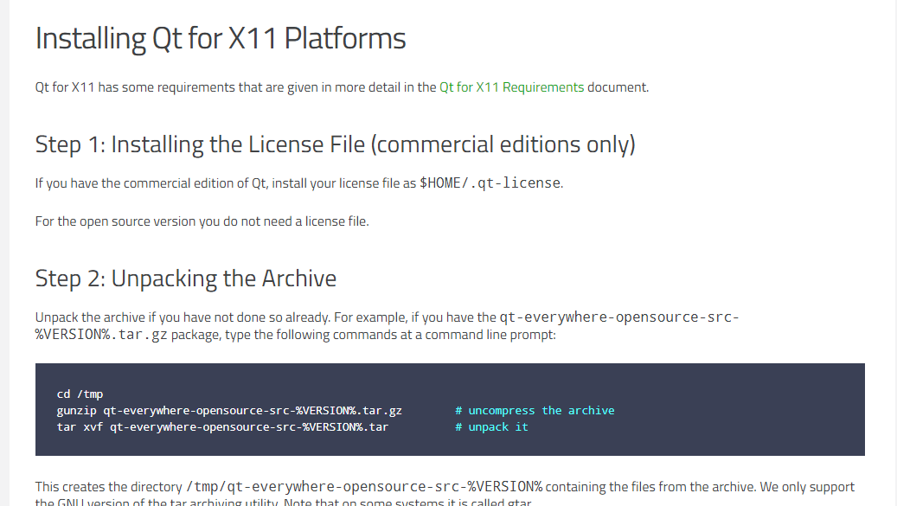
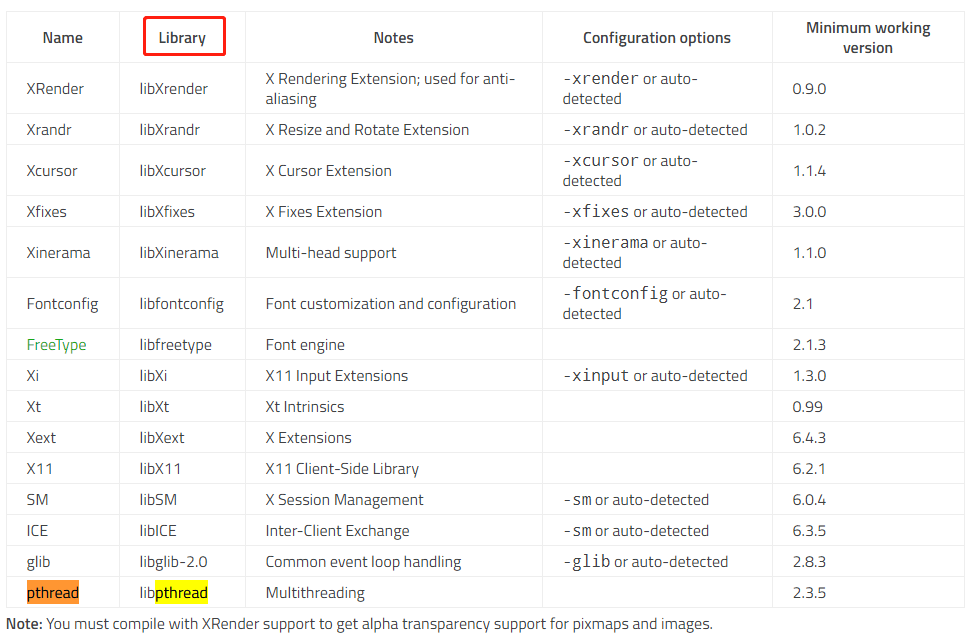

# 编译4.8.7版本

<!-- vim-markdown-toc GFM -->

* [进行影子编译(shadow build)](#进行影子编译shadow-build)
* [从源码`README`开始](#从源码readme开始)
* [安装相关依赖](#安装相关依赖)
* [编译源码](#编译源码)

<!-- vim-markdown-toc -->

## 进行影子编译(shadow build)

建立一个空的目录，用于配置和编译源码，避免污染源码目录

```shell
~/data/build/qt/4.8.7$ ls
build.sh
```

## 从源码`README`开始

解压源码

```shell
~/data/opt/qt$ ls
qt-everywhere-opensource-src-4.8.7.tar.gz
$ tar xvf qt-everywhere-opensource-src-4.8.7.tar.gz
```

源码目录下`README`



源码目录下`INSTALL`



URL: [编译各个平台](http://qt-project.org/doc/qt-4.8/installation.html)



URL: [安装X11平台的依赖库](https://doc.qt.io/archives/qt-4.8/requirements-x11.html)



URL: [编译X11平台](http://qt-project.org/doc/qt-4.8/install-x11.html)



## 安装相关依赖

* QtGui依赖项(QtGui Dependencies)



recommend install packages:

```shell
$ sudo apt install -y libfontconfig1-dev libfreetype6-dev libx11-dev libxcursor-dev libxext-dev libxfixes-dev libxft-dev libxi-dev libxrandr-dev libxrender-dev
```

* OpenGL依赖项(OpenGL Dependencies)

    * 安装`C/C++`编译环境

    ```shell
    $ sudo apt install -y build-essential
    ```

    * OpenGL核心库，GL

    ```shell
    $ sudo apt install -y libgl1-mesa-dev
    $ sudo apt install -y libgles2-mesa-dev  # 嵌入式平台
    ```

    * OpenGL实用函数库，GLU

    ```shell
    $ sudo apt install -y libglu1-mesa-dev
    ```

    * OpenGL实用工具包，GLUT

    ```shell
    $ sudo apt install -y freeglut3-dev
    ```

    * 额外安装的包

    ```shell
    $ sudo apt install -y libglew-dev libsdl2-dev libsdl2-image-dev libglm-dev libfreetype6-dev libglfw3-dev libglfw3
    ```

    ```shell
    # 整合在一起方便安装
    $ sudo apt install -y build-essential libgl1-mesa-dev libglu1-mesa-dev freeglut3-dev libglew-dev libsdl2-dev libsdl2-image-dev libglm-dev libfreetype6-dev libglfw3-dev libglfw3
    ```

* 多媒体相关性(Phonon Dependencies)

```shell
$ sudo apt install -y libgstreamer1.0-0
$ sudo apt install -y gstreamer1.0-plugins-base
$ sudo apt install -y gstreamer1.0-plugins-good
$ sudo apt install -y gstreamer1.0-plugins-bad
$ sudo apt install -y gstreamer1.0-plugins-ugly
$ sudo apt install -y gstreamer1.0-libav
$ sudo apt install -y gstreamer1.0-doc
$ sudo apt install -y gstreamer1.0-tools
$ sudo apt install -y gstreamer1.0-x
$ sudo apt install -y gstreamer1.0-alsa
$ sudo apt install -y gstreamer1.0-gl
$ sudo apt install -y gstreamer1.0-gtk3
$ sudo apt install -y gstreamer1.0-qt5
$ sudo apt install -y gstreamer1.0-pulseaudio

# 整合在一起方便安装
$ sudo apt install -y libgstreamer1.0-0 gstreamer1.0-plugins-base gstreamer1.0-plugins-good gstreamer1.0-plugins-bad gstreamer1.0-plugins-ugly gstreamer1.0-libav gstreamer1.0-doc gstreamer1.0-tools gstreamer1.0-x gstreamer1.0-alsa gstreamer1.0-gl gstreamer1.0-gtk3 gstreamer1.0-qt5 gstreamer1.0-pulseaudio
```

## 编译源码

详见[`build.sh`](build.sh)脚本

